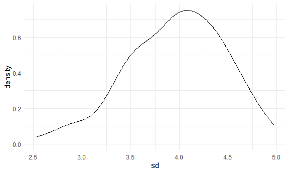

Simulations
================

``` r
library(tidyverse)
```

    ## -- Attaching packages ---------------------- tidyverse 1.3.0 --

    ## v ggplot2 3.3.2     v purrr   0.3.4
    ## v tibble  3.0.3     v dplyr   1.0.2
    ## v tidyr   1.1.2     v stringr 1.4.0
    ## v readr   1.3.1     v forcats 0.5.0

    ## -- Conflicts ------------------------- tidyverse_conflicts() --
    ## x dplyr::filter() masks stats::filter()
    ## x dplyr::lag()    masks stats::lag()

``` r
library(rvest)
```

    ## Loading required package: xml2

    ## 
    ## Attaching package: 'rvest'

    ## The following object is masked from 'package:purrr':
    ## 
    ##     pluck

    ## The following object is masked from 'package:readr':
    ## 
    ##     guess_encoding

``` r
knitr::opts_chunk$set(
  fig.width = 6,
  fig.asp = .6,
  out.width = "90%"
)


theme_set(theme_minimal()+theme(legend.position = "bottom"))

options(
  ggplot2.continuous.colur = "viridis",
  ggplot2.continuous.fill = "viridis"
)

scale_colour_discrete = scale_colour_viridis_d
scale_fill_discrete = scale_fill_viridis_d
```

## Let’s simulate something

I have a function

``` r
sim_mean_sd = function(samp_size, mu = 3, sigma = 4) {
  
  sim_data = 
  tibble(
    x = rnorm(n = samp_size, mean = mu, sd = sigma)
  )

  sim_data %>% 
    summarize(
      mean = mean(x),
      sd = sd(x)
  )
  
}
```

I can simulate by running this line

``` r
sim_mean_sd(30)
```

    ## # A tibble: 1 x 2
    ##    mean    sd
    ##   <dbl> <dbl>
    ## 1  3.99  4.31

## Let’s simulate a lot

let’s start with a for loop

``` r
output = vector("list", length = 100)

for (i in 1:100) {
  
  output[[i]] = sim_mean_sd(samp_size = 30)
}

bind_rows(output)
```

    ## # A tibble: 100 x 2
    ##     mean    sd
    ##    <dbl> <dbl>
    ##  1  1.72  3.31
    ##  2  3.52  3.39
    ##  3  2.37  3.46
    ##  4  4.53  3.97
    ##  5  2.26  4.34
    ##  6  2.95  3.50
    ##  7  2.16  4.31
    ##  8  1.84  4.09
    ##  9  4.46  3.87
    ## 10  2.90  4.54
    ## # ... with 90 more rows

Let’s use a loop function

``` r
sim_results = 
  rerun(100, sim_mean_sd(samp_size = 30)) %>% 
  bind_rows()
```

Let’s look at results

``` r
sim_results %>% 
  ggplot(aes(x = mean)) +
  geom_density()
```


``` r
sim_results %>% 
  summarise(
    avg_samp_mean = mean(mean), 
    sd_samp_mean = sd(mean)
  )
```

    ## # A tibble: 1 x 2
    ##   avg_samp_mean sd_samp_mean
    ##           <dbl>        <dbl>
    ## 1          2.96        0.825

``` r
sim_results %>% 
  ggplot(aes(x = sd)) +
  geom_density()
```


